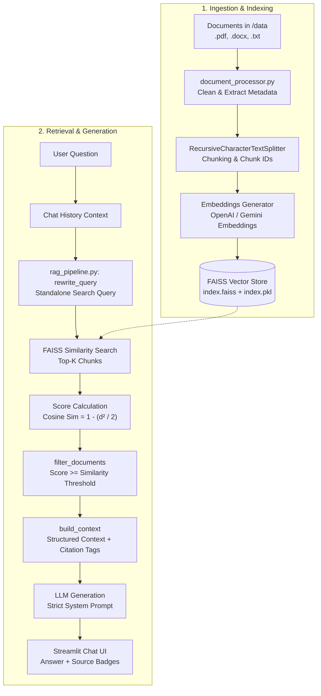

# 🏢 NovaTech Knowledge Assistant — Enterprise RAG Pipeline

A production-grade, modular **Retrieval-Augmented Generation (RAG)** application built with **Python**, **LangChain**, **FAISS**, and **Streamlit**. 

The assistant provides grounded, verifiable answers to questions about internal organizational knowledge (such as the company's AI Engineering Guide and Employee Policies) while strictly preventing hallucinations and citing document sources, page numbers, and section headings.

---

## 📑 Table of Contents

- [Overview](#-overview)
- [Key Features](#-key-features)
- [Architecture & Workflow](#-architecture--workflow)
- [Project Structure](#-project-structure)
- [Prerequisites](#-prerequisites)
- [Installation & Setup](#-installation--setup)
- [Configuration Reference](#-configuration-reference)
- [Running the Application](#-running-the-application)
- [How It Works (Deep Dive)](#-how-it-works-deep-dive)
  - [1. Multi-Format Ingestion & Cleaning](#1-multi-format-ingestion--cleaning)
  - [2. Semantic Chunking & Metadata Enrichment](#2-semantic-chunking--metadata-enrichment)
  - [3. Isolated Vector Stores](#3-isolated-vector-stores)
  - [4. Conversational Query Rewriting](#4-conversational-query-rewriting)
  - [5. Cosine Similarity & Relevance Filtering](#5-cosine-similarity--relevance-filtering)
  - [6. Grounded Answer Generation](#6-grounded-answer-generation)
- [Sample Testing Questions](#-sample-testing-questions)
- [Troubleshooting](#-troubleshooting)
- [License](#-license)

---

## 🌟 Overview

Standard Large Language Models (LLMs) can invent plausible-sounding details (hallucinations) when asked about private enterprise documents. **NovaTech Knowledge Assistant** implements a robust, end-to-end RAG architecture that:
1. Indexes local enterprise documents (`.pdf`, `.docx`, `.txt`) into a persistent local **FAISS** vector store.
2. Rewrites follow-up conversation queries into standalone search statements.
3. Performs semantic retrieval with true cosine similarity scoring.
4. Prunes irrelevant matches with a dynamic threshold.
5. Injects cited context into prompt templates to guarantee factual responses with direct source references.

---

## ✨ Key Features

- **Multi-Format Ingestion**: Supports `.pdf` (page-aware via PyPDF), `.docx` (section-aware via python-docx), and `.txt` files with automated whitespace cleanup and paragraph structure preservation.
- **Dual LLM & Embedding Support**: Seamlessly switch between **OpenAI** (`gpt-4.1-mini`, `text-embedding-3-small`) and **Google Gemini** (`gemini-2.5-flash`, `models/gemini-embedding-001`).
- **Zero Server Setup (Local FAISS)**: High-performance vector similarity search stored on disk without requiring cloud vector databases or external services.
- **Model-Isolated Vector Stores**: Automatically segregates vector indexes by provider and model name (e.g., `vector_store/openai_text_embedding_3_small/`), avoiding vector space dimension mismatch.
- **Conversational Query Rewriting**: Resolves ambiguous pronouns (`"What are its security requirements?"`) using recent chat history to retrieve accurate document passages.
- **Normalized Cosine Scoring**: L2-normalizes vector embeddings to calculate true cosine similarity from FAISS squared L2 distance via $1 - (d^2 / 2)$.
- **Relevance Threshold Filtering**: Discards low-relevance chunks before passing context to the LLM to prevent off-topic noise and context dilution.
- **Grounded Citations & Fallback**: Instructs the model to cite exact source files, pages, and section headings, and gracefully responds with a standard refusal if the knowledge base does not contain the answer.
- **Interactive Streamlit Web UI**: Real-time chat interface featuring:
  - Expandable source citation drawers with relevance scores.
  - Sidebar hyperparameter controls (Provider, Model, Temperature, Top-K, Similarity Threshold).
  - One-click vector store rebuild button.
- **Document Synthesis Utility**: Includes a built-in generator script (`generate_sample_documents.py`) to create sample DOCX and PDF enterprise files.

---

## 🏗 Architecture & Workflow



---

## 📁 Project Structure

```text
RAGLiveProject/
├── app.py                         # Streamlit chat interface and sidebar settings
├── config.py                      # Application configuration, environment variables, validation
├── document_processor.py          # Document loader (PDF/DOCX/TXT), text cleaning, and chunking
├── generate_sample_documents.py   # Script to generate sample DOCX and PDF enterprise docs
├── llm_client.py                  # Factory for OpenAI & Gemini chat models and embeddings
├── loader.py                      # Standalone utility for quick document loading and chunking
├── rag_pipeline.py                # Core RAG pipeline (index build, retrieval, rewriting, answering)
├── requirements.txt               # Project dependencies
├── .env.example                   # Template for environment variables and secrets
├── .env                           # Local environment configuration (ignored in version control)
├── data/                          # Document repository (source files)
│   ├── ai_engineering_guide.docx  # Sample DOCX: AI engineering practices and standards
│   └── employee_policies.pdf      # Sample PDF: Employee handbook, leave, and conduct policies
└── vector_store/                  # Persisted FAISS vector stores (separated per model)
    └── openai_text_embedding_3_small/
        ├── index.faiss            # FAISS vector index binary
        └── index.pkl              # Document metadata mapping pickle
```

---

## 📋 Prerequisites

- **Python**: Version 3.10, 3.11, or 3.12 recommended.
- **API Key**: An API key from at least one provider:
  - [OpenAI Platform API Key](https://platform.openai.com/api-keys)
  - [Google AI Studio Gemini API Key](https://aistudio.google.com/app/apikey)

---

## 🚀 Installation & Setup

### 1. Clone or Open the Repository

```bash
cd d:/IITPatna/GenAI-DEV-Projects/RAGLiveProject
```

### 2. Set Up a Virtual Environment

**On Windows (PowerShell):**
```powershell
python -m venv venv
.\venv\Scripts\Activate.ps1
```

**On macOS/Linux:**
```bash
python3 -m venv venv
source venv/bin/activate
```

### 3. Install Dependencies

```bash
pip install --upgrade pip
pip install -r requirements.txt
```

### 4. Configure Environment Variables

Copy `.env.example` to create your local `.env` file:

**On Windows (PowerShell):**
```powershell
Copy-Item .env.example .env
```

**On macOS/Linux:**
```bash
cp .env.example .env
```

Open `.env` in your editor and configure your API keys and provider:
```env
OPENAI_API_KEY=your_actual_openai_api_key
GEMINI_API_KEY=your_actual_gemini_api_key
LLM_PROVIDER=openai
```

### 5. Generate Sample Documents (Optional)

If your `data/` folder is empty or you want fresh copies of the sample enterprise files:
```bash
python generate_sample_documents.py
```
This generates:
- `data/ai_engineering_guide.docx`
- `data/employee_policies.pdf`

---

## ⚙️ Configuration Reference

All settings can be customized in `.env` or overridden dynamically via the Streamlit UI:

| Variable | Type | Default | Description |
| :--- | :---: | :---: | :--- |
| `LLM_PROVIDER` | `str` | `openai` | Active provider: `openai` or `gemini`. |
| `OPENAI_MODEL` | `str` | `gpt-4.1-mini` | Chat model for OpenAI generation. |
| `GEMINI_MODEL` | `str` | `gemini-2.5-flash` | Chat model for Google Gemini generation. |
| `OPENAI_EMBEDDING_MODEL` | `str` | `text-embedding-3-small` | OpenAI embedding model name. |
| `GEMINI_EMBEDDING_MODEL` | `str` | `models/gemini-embedding-001` | Gemini embedding model name. |
| `TEMPERATURE` | `float` | `0.2` | Controls randomness in generation (0.0 to 1.0). |
| `TOP_K` | `int` | `5` | Maximum number of chunks to retrieve per search. |
| `SIMILARITY_THRESHOLD` | `float` | `0.35` | Minimum cosine similarity score for relevant chunks. |
| `CHUNK_SIZE` | `int` | `900` | Target chunk size in characters. |
| `CHUNK_OVERLAP` | `int` | `150` | Overlap character count between consecutive chunks. |

---

## 💻 Running the Application

Launch the Streamlit web application:

```bash
streamlit run app.py
```

Once started, the application opens in your browser at:
```
http://localhost:8501
```

### Rebuilding the Index
Whenever you add, modify, or remove documents in the `data/` directory:
1. Open the sidebar in the Streamlit app.
2. Click **Rebuild Vector Store**.
3. The app reprocesses all files, regenerates embeddings, and refreshes the FAISS index automatically.

---

## 🔬 How It Works (Deep Dive)

### 1. Multi-Format Ingestion & Cleaning
- **PDF Documents (`pypdf`)**: Extracted page by page, tagging each chunk with `page: <number>` and `source: <filename>`.
- **DOCX Documents (`python-docx`)**: Headings are extracted and treated as section boundaries, tagging chunks with `section: <Heading Title>`.
- **Text Cleaning**: Replaces null bytes, normalizes line endings (`\r\n` to `\n`), collapses redundant spaces/tabs, and trims consecutive blank lines while preserving paragraph breaks.

### 2. Semantic Chunking & Metadata Enrichment
- Uses `RecursiveCharacterTextSplitter` with separators `["\n\n", "\n", ". ", " ", ""]`.
- Ensures semantic boundary preservation (paragraphs stay intact when possible).
- Attaches an incrementing `chunk_id` along with file origin metadata.

### 3. Isolated Vector Stores
- FAISS generates high-dimensional vector representations.
- Vectors from different embedding models (e.g. OpenAI 1536-dim vs. Gemini 768-dim) are stored in dedicated directories:
  ```
  vector_store/{provider}_{embedding_model_safe_name}/
  ```
- Prevents dimensionality mismatch errors and vector contamination when switching providers in the UI.

### 4. Conversational Query Rewriting
- When the user asks follow-up questions (e.g., *"What is its policy on hybrid work?"* after asking about *"AI engineering practice"*):
- The pipeline passes the last 6 messages to the LLM with a dedicated rewriting prompt:
  ```text
  Rewrite the latest question as one standalone search query.
  Resolve pronouns using the conversation. Preserve the user's meaning.
  Return only the rewritten query.
  ```
- Retrieval executes against the unambiguous rewritten query while the natural conversation flows seamlessly.

### 5. Cosine Similarity & Relevance Filtering
- FAISS vectors are indexed with `normalize_L2=True`.
- FAISS returns squared Euclidean distance ($d^2$). Because vectors are on the unit sphere, cosine similarity is directly computed via:
  $$\text{Cosine Similarity} = 1 - \frac{d^2}{2}$$
- Chunks scoring below `SIMILARITY_THRESHOLD` are discarded before reaching the LLM context window.

### 6. Grounded Answer Generation
- Context is assembled with distinct source tags:
  ```text
  [Source: ai_engineering_guide.docx, section Retrieval-Augmented Generation Standard]
  <chunk text>
  ```
- The strict system prompt mandates:
  - Rely exclusively on provided context.
  - Never fabricate information.
  - Cite the sources used.
  - Respond with *"I could not find that information in the NovaTech knowledge base."* if no relevant facts exist.

---

## 💬 Sample Testing Questions

Try asking the assistant these questions to verify its performance:

| Question Type | Example Prompt | Expected Behavior |
| :--- | :--- | :--- |
| **Direct Retrieval (DOCX)** | *"What are the RAG standards followed at NovaTech?"* | Cites `ai_engineering_guide.docx` (section: Retrieval-Augmented Generation Standard) with chunk size & overlap details. |
| **Direct Retrieval (PDF)** | *"What is NovaTech's remote and hybrid work policy?"* | Cites `employee_policies.pdf` (page 1) with specific guidelines. |
| **Conversational Follow-up** | *"What are the incident reporting requirements for it?"* | Demonstrates query rewriting, resolving "it" to the previously discussed topic. |
| **Out-of-Scope (Refusal)** | *"What is the revenue of Apple in 2024?"* | Gracefully declines: *"I could not find that information in the NovaTech knowledge base."* |

---

## 🛠 Troubleshooting

<details>
<summary><b>Error: <code>OPENAI_API_KEY is missing</code> or <code>GEMINI_API_KEY is missing</code></b></summary>

- Ensure your `.env` file exists in the root directory (not `.env.txt` or `.env.example`).
- Ensure the key corresponding to `LLM_PROVIDER` is set without spaces or quotes:
  ```env
  OPENAI_API_KEY=sk-proj-xxxx...
  ```
- Restart the Streamlit server after editing `.env`.
</details>

<details>
<summary><b>Error: <code>No chunks were created from the source documents</code></b></summary>

- Verify that your `data/` directory contains readable files (`.pdf`, `.docx`, or `.txt`).
- If empty, run `python generate_sample_documents.py` to create sample files.
</details>

<details>
<summary><b>Zero sources found or assistant answers with refusal for valid questions</b></summary>

- The `SIMILARITY_THRESHOLD` might be set too high for the current embedding model.
- Lower the **Cosine similarity threshold** in the sidebar (e.g., from `0.35` down to `0.20` or `0.25`).
- Ensure you have clicked **Rebuild Vector Store** after switching embedding models.
</details>

<details>
<summary><b>Switching between OpenAI and Gemini creates vector dimension errors</b></summary>

- The pipeline automatically isolates vector stores into separate subdirectories under `vector_store/`.
- If an older manual index exists, click **Rebuild Vector Store** in the sidebar to regenerate clean indexes.
</details>

---

## 📄 License

This project is licensed under the [MIT License](LICENSE). Built for learning and enterprise RAG reference.
